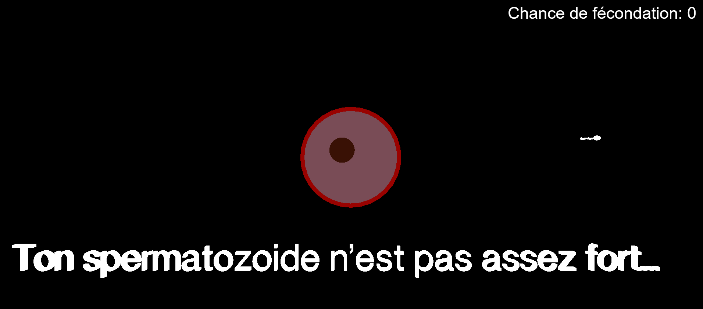

Pour lancer le projet:
  - cd three_vite
  - npm run dev
  - browser at : http://localhost:5173/three_vite/

Le projet montre l'évolution d'un spermatozoïde dans les trompes de fallopes.
Les virus présents dans les trompes de fallopes représentent des maladies comme
la salpingite ou bien des cellules immunitaires présentes dans les trompes.

Pensez à mettre le son !

Utilisez les flèches directionnelles pour vous déplacer.
Appuyez sur w pour gagner et voir l'animation de victoire.
Appuyez sur l pour perdre et voir l'animation de défaite.

